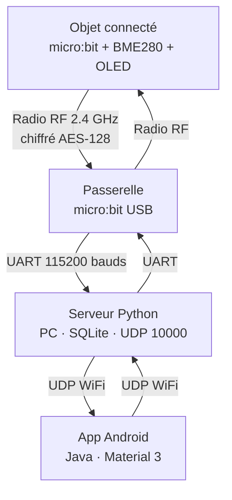
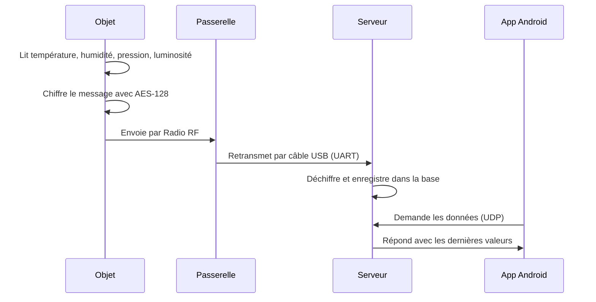
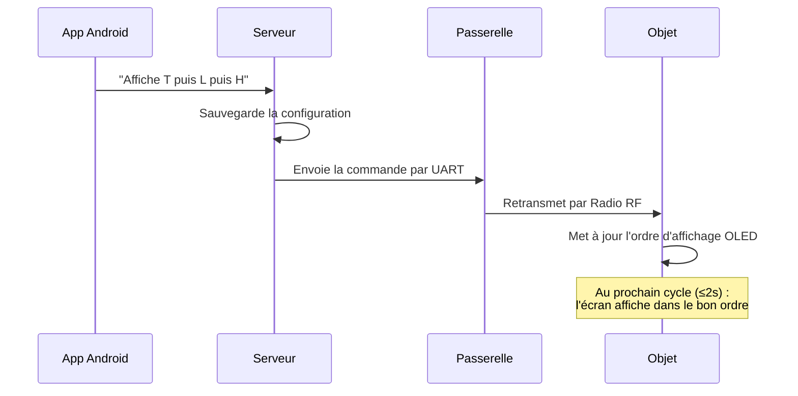
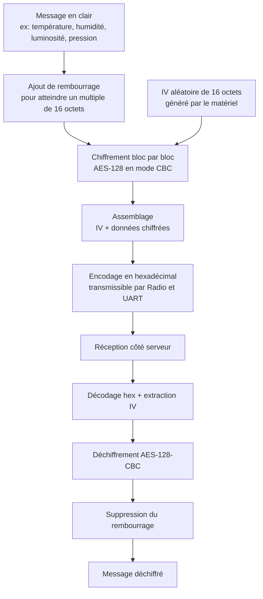
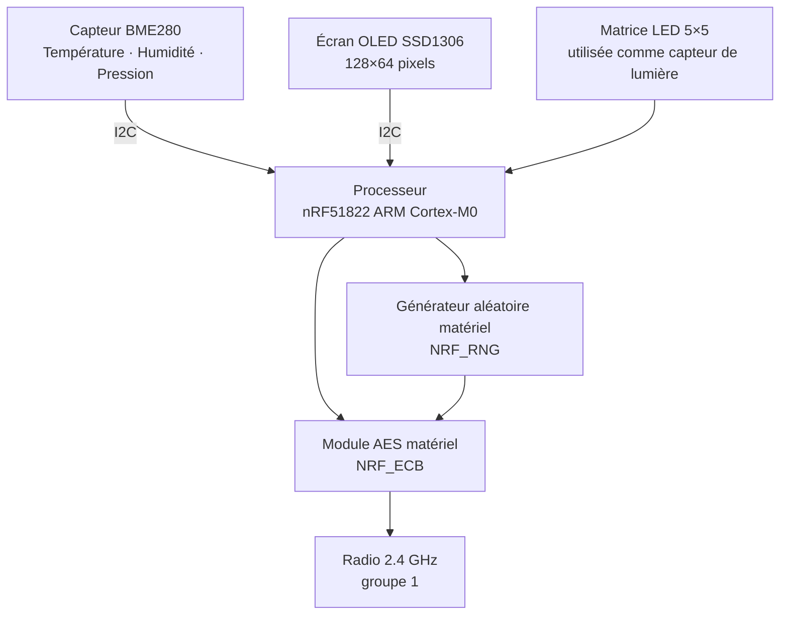
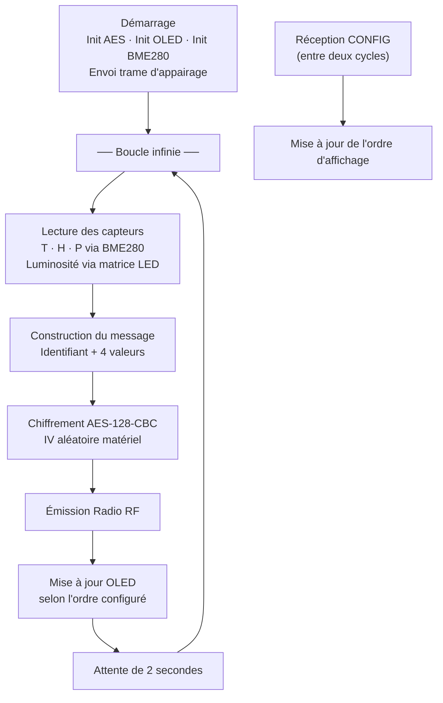
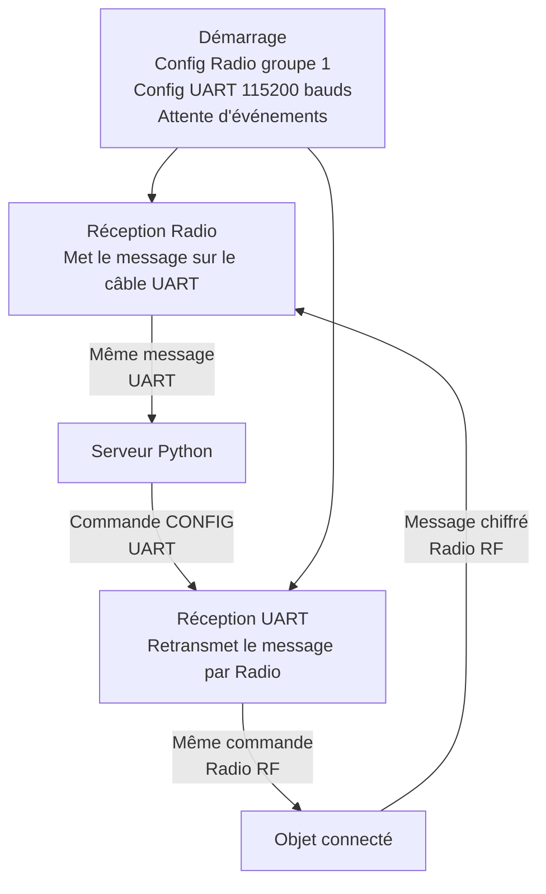
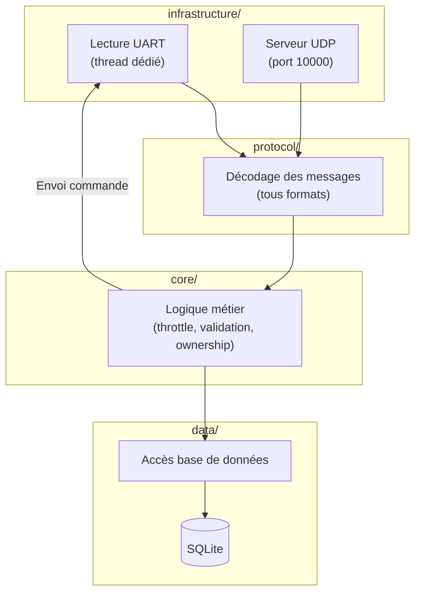
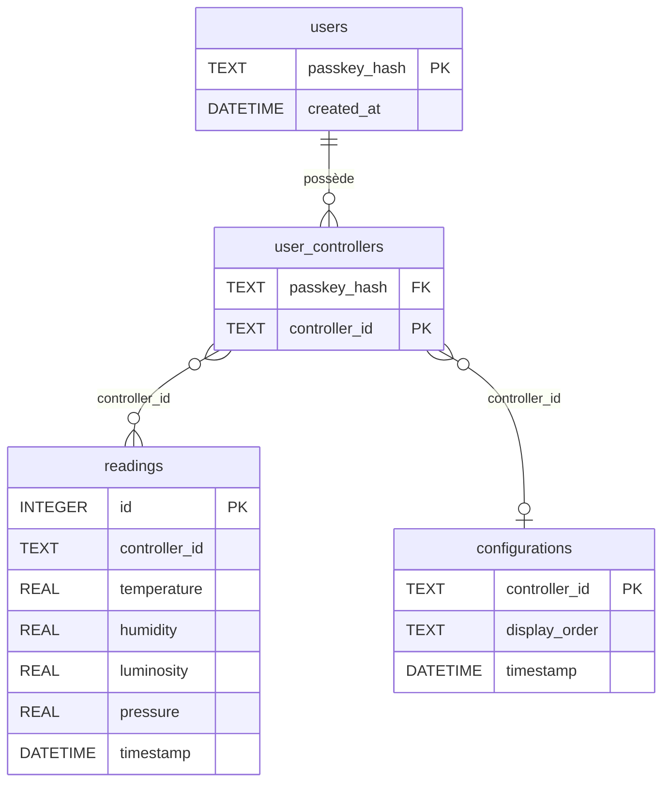
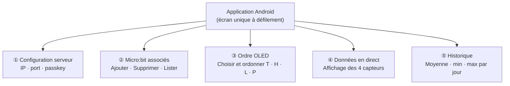

# Rendu — Mini-architecture IoT

**Module** : Développement embarqué et IoT — 2026  
**Groupe** : 13

| Membre | Contribution principale |
|---|---|
| Quentin Bastos | Application Android, protocole serveur, sécurité |
| Théo Demaria | Serveur (architecture, alignement protocole) |
| Adel Hocine Boudjadja | Objet connecté (capteurs, OLED) |
| Arnaud Decourt | Serveur, intégration passerelle |

---

## 1. Objectif du projet

Déployer une **architecture IoT complète** permettant de :

- **Collecter** des données environnementales (température, humidité, pression, luminosité) depuis un micro:bit installé dans un bureau.
- **Stocker et exposer** ces données via un serveur Python sur PC.
- **Configurer à distance** l'ordre d'affichage d'un écran OLED depuis un smartphone Android.
- **Gérer plusieurs objets** simultanément, dans plusieurs bureaux, pour plusieurs utilisateurs.

---

## 2. Architecture générale

La chaîne IoT repose sur quatre briques communicant en cascade :



| Brique | Rôle | Technologie |
|---|---|---|
| **Objet** | Mesure, chiffre, émet, affiche OLED | C/C++, micro:bit DAL, yotta |
| **Passerelle** | Relais transparent radio ⇄ UART | C/C++, micro:bit DAL, yotta |
| **Serveur** | Déchiffre, stocke, répond UDP | Python 3, SQLite |
| **App Android** | Configure, contrôle, consulte | Java, Material 3 |

---

## 3. Flux de données

### 3.1 Remontée d'une mesure capteur



L'objet émet une trame chiffrée toutes les 2 secondes. Au démarrage, il envoie d'abord une trame d'appairage `PAIR|secret|id` chiffrée : le serveur ne fait confiance qu'aux objets connaissant le secret partagé.

### 3.2 Envoi d'une commande d'affichage



---

## 4. Sécurité

Toutes les trames émises par l'objet sont chiffrées avec **AES-128 en mode CBC**, via le module matériel **NRF_ECB** du nRF51. Le vecteur d'initialisation (IV) est tiré aléatoirement par le générateur matériel **NRF_RNG** à chaque trame.



| Couche | Mécanisme | Détail |
|---|---|---|
| **Radio → UART** | AES-128-CBC | IV unique par trame (matériel), encodage hex |
| **Appairage** | Message chiffré avec secret partagé | Seuls les objets connaissant le secret sont acceptés |
| **Passkeys** | PBKDF2-SHA256 | 200 000 itérations avant stockage |
| **Anti-rejeu** *(optionnel)* | Horodatage Unix ±10 s | Mécanisme disponible côté serveur mais non activé par défaut (aucun client n'envoie d'horodatage) |
| **Rate-limit UDP** | 50 requêtes / 10 s / adresse IP | Protection contre le brute-force |
| **Ownership** | Table `user_controllers` SQLite | Un objet n'appartient qu'à un seul utilisateur |

---

## 5. Objet connecté (`micro/`)

### 5.1 Matériel embarqué



### 5.2 Capteurs et affichage

Le **BME280** retourne des valeurs brutes (ADC) converties via **18 coefficients de calibration** (3 température, 9 pression, 6 humidité) lus au démarrage, selon la formule de compensation Bosch. La température (`fine_temp`) est calculée d'abord car elle conditionne le calcul de l'humidité et de la pression. La **luminosité** est obtenue via la matrice LED 5×5 utilisée comme photodiode (0..255). Représentation interne : `2230` → `22.3 °C`, `5800` → `58 %`.

L'**écran OLED** est piloté par un buffer image de 1024 octets en mémoire, envoyé en un seul transfert I2C à chaque rafraîchissement (affichage sans scintillement). Chaque caractère occupe une tuile 8×8 d'une police bitmap embarquée. L'ordre des lignes affichées (T, H, L, P) est mis à jour dynamiquement par la commande `CONFIG` reçue du serveur.

### 5.3 Boucle principale — cycle de 2 secondes



La réception d'une commande `CONFIG` est gérée par le **scheduler fiber** du DAL micro:bit : listener radio et boucle principale partagent le même fiber, sérialisés entre deux `yield`. L'événement s'intercale donc entre les étapes de la boucle (pendant le `sleep`), sans verrou nécessaire et sans bloquer les mesures. Au démarrage, l'ordre d'affichage est initialisé à `"T"` (seule la température s'affiche) jusqu'à réception du premier `CONFIG`.

### 5.4 Structure des fichiers

```
micro/source/
├── main.cpp       Boucle principale · chiffrement · réception CONFIG
├── bme280.cpp/.h  Pilote capteur T/H/P avec compensation Bosch
├── ssd1306.cpp/.h Pilote écran OLED 128×64
├── nrf_ecb.c/.h   Pilote module AES matériel
└── font.h         Police bitmap 8×8 pixels
```

Build (Docker yotta), flash et détails : voir `micro/README.md` et `micro/NOTES-TP.md`.

---

## 6. Passerelle (`gateway/microbit-samples/`)

La passerelle ne contient **aucune logique métier** : elle fait suivre les messages dans les deux sens, sans les modifier. Construite avec les mêmes outils que l'objet (yotta, micro:bit DAL), elle repose sur deux gestionnaires d'événements. Le programme principal se termine par `release_fiber()`, qui passe la main au scheduler d'événements du DAL — lequel reste actif indéfiniment.



| Paramètre | Valeur | Raison |
|---|---|---|
| Bluetooth | Désactivé | Libère la radio pour le mode datagramme |
| Taille max paquet radio | 251 octets | Accueille un message chiffré en hexadécimal |
| Groupe radio | 1 | Identique à l'objet connecté |
| Débit UART | 115 200 bauds | Correspond à la config du serveur |
| Délimiteur | `\n` | Sépare les trames côté Python |

Build et flash : voir `gateway/microbit-samples/README.md`.

---

## 7. Serveur (`server/`)

Dépendances : `pyserial` · `cryptography` (2 bibliothèques). Architecture en 4 couches indépendantes (Domain-Driven Design) : chaque couche ne connaît que celle en dessous.



- `infrastructure/` — Lecture UART (déchiffrement AES, retransmission vers l'objet) et serveur UDP avec rate-limit.
- `protocol/` — Détecte et décode les formats (hex chiffré, pipe, JSON, CSV) et encode les réponses.
- `core/` — Throttle 10s (une insertion par contrôleur / 10s), validation d'horodatage optionnelle (±10s), ownership.
- `data/` — Requêtes SQL, migration automatique de schéma, connexion SQLite en mode WAL.

### 7.1 Schéma relationnel SQLite



Un index `(controller_id, timestamp DESC)` accélère les requêtes de consultation et d'historique.

### 7.2 Traitement d'une ligne série

À la réception d'une ligne UART, le serveur applique 5 étapes, en s'arrêtant au premier format reconnu :

1. **Hexadécimal** → déchiffrement AES-128.
2. **`PAIR|secret|id`** → ajout aux appareils de confiance si le secret est valide.
3. **Pipe** `id|T:..,H:..` → lecture multi-capteurs.
4. **JSON** `{"T":..}` → lecture multi-capteurs.
5. **CSV** `ctrl,capteur,valeur` → lecture simple.

La donnée passe ensuite par le throttle 10s avant insertion.

### 7.3 Format des réponses

**GET** — une ligne par capteur disponible :
```
5E90D3CB,T,22.3
5E90D3CB,H,58.0
5E90D3CB,L,89.0
5E90D3CB,P,1012.0
```

**HISTORY** — 14 colonnes par jour (moyenne/min/max pour T, H, L, P + nombre de mesures) :
```
2026-05-19,22.50,20.10,24.80,57.20,52.00,63.00,,,,1011.30,1008.00,1015.00,12
```

### 7.4 Tests automatisés

**56 tests** couvrent chaque couche : 40 unitaires (protocole/AES + base de données), 13 d'intégration (service métier), 2 d'infrastructure (UDP) et 1 bout-en-bout (cycle complet). Cas couverts : round-trip AES, parsing de tous les formats, throttle 10s, agrégats journaliers, multi-utilisateurs, purge sur REMOVE, rate-limit UDP, validation d'horodatage (mécanisme optionnel). Lancement : `python -m unittest discover tests` (~2 s, 0 erreur).

Lancement du serveur et options : voir `server/README.md`. Le `--shared-secret` doit rester identique à `SHARED_SECRET` dans `micro/source/main.cpp`.

---

## 8. Application Android (`application/`)

`minSdk` 31 (Android 12+) · `targetSdk` 36 · Java · Material 3.

```
app/src/main/java/com/example/bureaubientre/
├── MainActivity.java   Activité unique — UI, état, appels réseau
├── UdpClient.java      Envoi simple ou envoi + attente réponse (timeout 5s)
└── SensorData.java     Parsing des données capteurs · NaN si absent
```

### 8.1 Interface — 5 sections Material 3



### 8.2 Protocole UDP côté Android

| Commande envoyée | Réponse serveur |
|---|---|
| `INIT,<passkey>` | `OK` |
| `LIST,<passkey>` | `ctrl1\nctrl2\n…` |
| `ADD,<passkey>,<id>` | `OK` / `UNAUTHORIZED` |
| `REMOVE,<passkey>,<id>` | `OK` / `ERROR` |
| `GET,<passkey>,<id>` | `ctrl,T,22.3\nctrl,H,58\n…` |
| `HISTORY,<passkey>,<id>,7` | CSV agrégé (14 colonnes/jour) |
| `<id>,CONFIG,TLH` | *(transmis vers l'objet via le serveur)* |

Chaque appel réseau tourne sur un thread dédié ; les résultats reviennent sur le thread UI via un Handler. La config (IP, port, passkey) est persistée en `SharedPreferences`. Le smartphone et le PC doivent être sur le **même réseau WiFi** ; saisir l'**adresse IP du PC** (pas `localhost`).

Build et installation : voir `application/README.md`.

---

## 9. État d'avancement

| Fonctionnalité | État |
|---|---|
| Protocole objet ⇄ passerelle bidirectionnel (Radio + UART) | ✅ |
| Chiffrement AES-128-CBC + appairage (NRF_ECB / NRF_RNG) | ✅ |
| Gestion multi-objets (ownership par utilisateur) | ✅ |
| Capteurs T / H / P (BME280) + luminosité (matrice LED) | ✅ |
| Affichage OLED dans l'ordre demandé (tous les cas T/H/L/P) | ✅ |
| Passerelle relais radio ⇄ UART (événementiel) | ✅ |
| Serveur UDP + SQLite (throttle 10s, mode WAL) | ✅ |
| Formats d'échange (pipe / JSON / CSV) | ✅ |
| App Android (config, ordre, données, historique) | ✅ |
| Sécurité passkeys PBKDF2 + rate-limit UDP | ✅ |
| 56 tests automatisés | ✅ |
| Interface web type Grafana | ❌ optionnel |
| Push automatique serveur → app (l'app rafraîchit à la demande) | ❌ optionnel |

Toutes les exigences **obligatoires** de l'énoncé sont couvertes.

---

## 10. Choix technologiques

| Brique | Choix | Justification |
|---|---|---|
| Objet / Passerelle | C/C++, micro:bit DAL, yotta | Accès direct aux modules AES et RNG matériels — impossible depuis MicroPython |
| Chiffrement | AES-128-CBC matériel (NRF_ECB) | Sécurité réelle, quelques µs par bloc, sans bibliothèque logicielle |
| IV | NRF_RNG (entropie matérielle) | Imprévisibilité garantie par le matériel |
| Base de données | SQLite WAL | Sans serveur, fichier unique, agrégats SQL natifs |
| Passkeys | PBKDF2-SHA256 200k itér. | Standard industrie, résistance brute-force |
| Architecture serveur | DDD 4 couches | Testabilité par couche, séparation des responsabilités |
| Format radio → UART | Hexadécimal ASCII | Transmissible sur UART sans encodage supplémentaire |
| Application | Android natif Java | Contrôle fin des sockets UDP, zéro dépendance tierce |
| Transport app | UDP | Imposé par l'énoncé |
