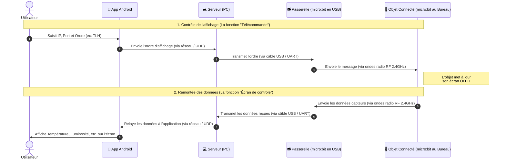

# iot-project

## 📚 Documentation
[Accéder au Notion du projet](https://www.notion.so/IOT-Mini-project-33b5e495ffbe80759045efac36a5daa0?source=copy_link)

## 🏗️ Architecture globale

```mermaid
sequenceDiagram
    autonumber
    actor Utilisateur
    participant App as 📱 App Android
    participant Serveur as 💻 Serveur (PC)
    participant Passerelle as 📻 Passerelle (micro:bit en USB)
    participant Objet as 🌡️ Objet Connecté (micro:bit au Bureau)

    %% Envoi d'ordres d'affichage
    Note over Utilisateur, Objet: 1. Contrôle de l'affichage (La fonction "Télécommande")
    Utilisateur->>App: Saisit IP, Port et Ordre (ex: TLH)
    App->>Serveur: Envoie l'ordre d'affichage (via réseau / UDP)
    Serveur->>Passerelle: Transmet l'ordre (via câble USB / UART)
    Passerelle->>Objet: Envoie le message (via ondes radio RF 2.4GHz)
    Note right of Objet: L'objet met à jour<br/>son écran OLED

    %% Réception des données capteurs
    Note over Utilisateur, Objet: 2. Remontée des données (La fonction "Écran de contrôle")
    Objet->>Passerelle: Envoie les données capteurs (via ondes radio RF 2.4GHz)
    Passerelle->>Serveur: Transmet les données reçues (via câble USB / UART)
    Serveur->>App: Relaye les données à l'application (via réseau / UDP)
    App->>Utilisateur: Affiche Température, Luminosité, etc. sur l'écran
```