# Rendu — Mini-architecture IoT

> [!info] Informations du groupe
> **Module** : Développement embarqué et IoT — 2026  
> **Groupe** : 67
>
> | Membre | Contribution principale |
> |---|---|
> | Quentin Bastos | Application Android, protocole serveur, sécurité |
> | Théo (EkkoFTW) | Serveur (architecture, alignement protocole) |
> | Adel Hocine Boudjadja | Objet connecté (capteurs, OLED) |
> | Arnaud Decourt | Serveur, intégration passerelle |
>
> Les rôles sont indicatifs ; chaque brique a été relue et testée en binôme.

---

## 1. Objectif du projet

L'objectif est de déployer une **architecture IoT complète** permettant de :

- **Collecter** des données environnementales (température, humidité, pression, luminosité) depuis un micro-contrôleur micro:bit installé dans un bureau.
- **Stocker et exposer** ces données via un serveur Python sur PC.
- **Configurer à distance** l'ordre d'affichage d'un écran OLED depuis un smartphone Android.
- **Gérer plusieurs objets** simultanément dans plusieurs bureaux, pour plusieurs utilisateurs.

---

## 2. Architecture générale

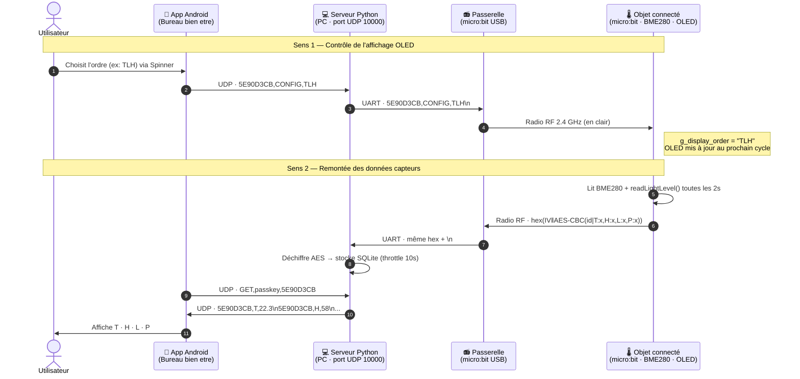

---

## 3. Vue d'ensemble des composants

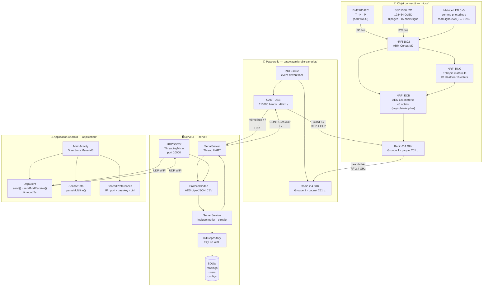

---

## 4. Protocole réseau

### 4.1 Objet ⇄ Passerelle (radio RF 2.4 GHz)

Les deux cartes (objet et passerelle) partagent la même configuration radio :

```json
{
  "microbit-dal": {
    "bluetooth": { "enabled": 0 },
    "radio_max_packet_size": 251
  }
}
```

> [!note] Pourquoi 251 octets ?
> La trame chiffrée `hex(IV‖ciphertext)` est en ASCII hexadécimal. Pour un payload de ~40 chars, le PKCS#7 donne 2 blocs de 16 octets soit 32 octets de ciphertext + 16 octets IV = 48 octets → 96 chars hex. La limite par défaut du DAL (32 octets) est insuffisante.

| Sens | Contenu en clair | Sur la radio |
|---|---|---|
| Boot — appairage | `PAIR\|groupe67\|5E90D3CB` | Chiffrée AES-128-CBC, hex ASCII |
| Données capteurs | `5E90D3CB\|T:22.3,H:58,L:89,P:1012` | Chiffrée AES-128-CBC, hex ASCII |
| Ordre OLED (reçu) | `5E90D3CB,CONFIG,TLH` | En clair — relais passerelle |

### 4.2 App Android ⇄ Serveur (UDP port 10 000)

| Commande | Réponse |
|---|---|
| `INIT,<passkey>` | `OK` |
| `LIST,<passkey>` | `ctrl1\nctrl2\n…` |
| `ADD,<passkey>,<id>` | `OK` / `UNAUTHORIZED` |
| `REMOVE,<passkey>,<id>` | `OK` / `ERROR` |
| `GET,<passkey>,<id>` | `ctrl,T,22.3\nctrl,H,58\n…` |
| `HISTORY,<passkey>,<id>,<jours>` | CSV agrégé jour par jour |
| `<id>,CONFIG,<ordre>` | *(broadcast vers l'objet)* |

---

## 5. Sécurité

> [!warning] Exigence de l'énoncé
> "Pensez aussi à la sécurité des données envoyées." Le déploiement multi-bureaux expose les trames radio à tout récepteur sur le même groupe RF.

### 5.1 Chiffrement AES-128-CBC de bout en bout

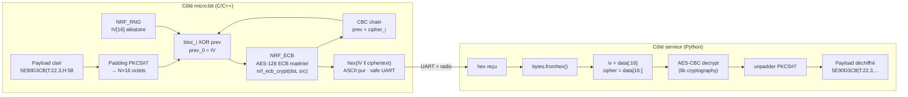

### 5.2 Détail du périphérique NRF_ECB

Le driver `nrf_ecb.c` expose une structure interne de **48 octets** directement mappée en mémoire matérielle :

```
ecb_data[0..15]  = clé AES (NRF_ECB->ECBDATAPTR pointe dessus)
ecb_data[16..31] = cleartext → entrée
ecb_data[32..47] = ciphertext ← sortie
```

`nrf_ecb_crypt()` écrit `TASKS_STARTECB = 1` et attend `EVENTS_ENDECB` (boucle de polling avec timeout à ~16 M cycles). Coût réel : ~6 µs par bloc sur 16 MHz.

### 5.3 Dérivation de la clé

```
shared_secret = "groupe67"  (8 chars)
AES_KEY[16]   = b"groupe67\x00\x00\x00\x00\x00\x00\x00\x00"
```

Même logique côté serveur (`derive_aes_key()` : zero-padding à 16 octets).

### 5.4 Couches de sécurité complètes

| Couche | Mécanisme | Détail |
|---|---|---|
| **Radio → UART** | AES-128-CBC | IV unique par trame (NRF_RNG), PKCS#7, hex ASCII |
| **Appairage** | `PAIR\|secret\|id` chiffré | Le serveur n'accepte que les devices connus |
| **Passkeys** | PBKDF2-SHA256 | 200 000 itérations + sel statique |
| **Anti-rejeu** | Timestamp Unix ±10 s | Valide sur `ADD` / `REMOVE` |
| **Rate-limit UDP** | 50 req / 10 s / IP | Protège contre brute-force passkey |
| **Ownership** | `user_controllers` en base | Un controller ne peut appartenir qu'à un seul utilisateur |

---

## 6. Objet connecté (`micro/`)

> [!success] Livrable ② — Code de l'objet connecté
> Dossier : `micro/` · Documentation : `micro/README.md` · Notes TP : `micro/NOTES-TP.md`

### 6.1 Pilote BME280 — lecture et compensation

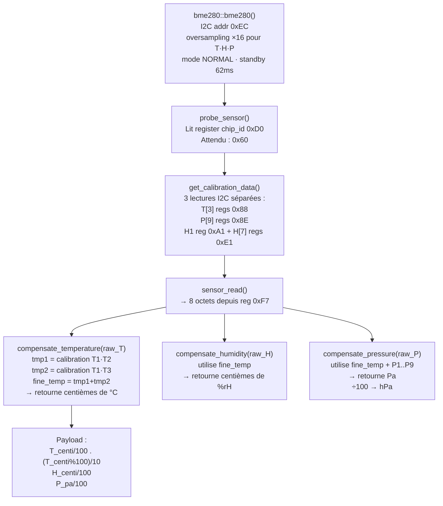

> [!note] Représentation interne
> - Température : entier en centièmes de °C — `g_T_centi = 2230` → `22.3°C`
> - Humidité : entier en centièmes de % — `g_H_centi = 5800` → `58%`
> - Pression : entier en hPa — `g_P_hpa = compensate_pressure() / 100`

### 6.2 Pilote SSD1306 — OLED 128×64

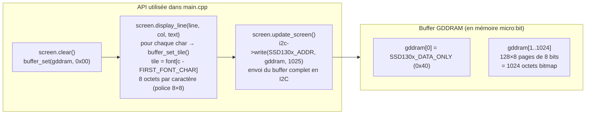

La séquence d'affichage dans `main.cpp` :
1. `screen.clear()` — efface le buffer
2. `screen.display_line(0, 0, "OBJET CONNECTE")`
3. `screen.display_line(1, 0, device_id)` — ex: `5E90D3CB`
4. Lignes 3 à 7 : itère sur `g_display_order`, appelle `display_sensor_line(screen, oled_line, code)`
5. `screen.update_screen()` — envoie les 1024 octets bitmap via I2C

### 6.3 Boucle principale et listener radio

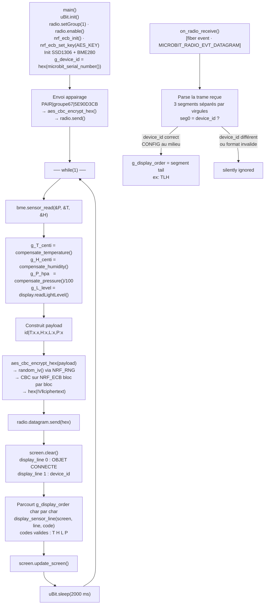

> [!note] Modèle de concurrence
> L'objet utilise le **scheduler fiber** du DAL micro:bit : `on_radio_receive` est enregistré sur le `messageBus`, il s'exécute entre deux instructions de la boucle principale (coopératif). Pas de mutex nécessaire — accès à `g_display_order` sérialisé par le scheduler.

### 6.4 Structure des fichiers

```
micro/source/
├── main.cpp       AES-CBC · boucle capteurs · OLED · listener CONFIG
├── bme280.cpp/.h  I2C addr 0xEC · oversampling ×16 · 13 coeffs calibration
├── ssd1306.cpp/.h I2C addr 0x7A · 128×64 · 8 pages · police 8×8
├── nrf_ecb.c/.h   NRF_ECB peripheral · nrf_ecb_init/set_key/crypt
└── font.h         Police bitmap 8×8 (FIRST_FONT_CHAR = espace ASCII 0x20)
```

### 6.5 Environnement de build

```bash
# Image Docker officielle du module
docker pull schoumi/yotta:latest
docker run -it -v "$PWD:/workspaces/microbit-samples" schoumi/yotta:latest

# Dans le conteneur
source /sync/Module_Dev_app_mobile/yotta/bin/activate
yt build

# Flash (Linux host)
make install   # → cp build/.../microbit-samples-combined.hex /media/$USER/MICROBIT/
```

Chaîne : `yotta` → `cmake` + `ninja` → `arm-none-eabi-gcc` → `.hex` + `srec_cat` → `-combined.hex`

---

## 7. Passerelle (`gateway/microbit-samples/`)

> [!success] Livrable ③ — Code de la passerelle
> Dossier : `gateway/microbit-samples/` · Documentation : `gateway/microbit-samples/README.md`

### 7.1 Principe — relais transparent événementiel

La passerelle ne contient **aucune logique métier**. Le `main()` se termine par `release_fiber()` qui endort la tâche principale mais laisse le **système d'événements** du DAL tourner indéfiniment.

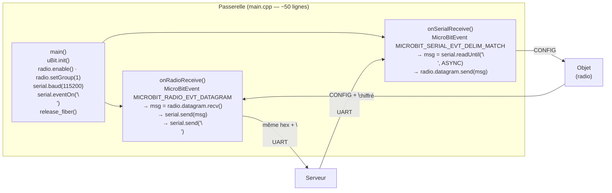

> [!note] `release_fiber()` vs `while(1)`
> Contrairement à `return 0` qui arrêterait l'exécution, `release_fiber()` libère le fiber du `main()` et laisse le scheduler DAL gérer les deux listeners. Pas de busy-wait, pas de polling.

### 7.2 Configuration détaillée

```
config.json (gateway/microbit-samples/)
├── bluetooth.enabled = 0      → libère la pile radio pour le mode datagram brut
└── radio_max_packet_size = 251 → accueille hex(IV 16o + payload ~48o) = ~128 chars hex

source/main.cpp
├── radio.setGroup(1)           → identique à l'objet (groupe alloué à l'équipe)
├── serial.baud(115200)         → doit correspondre à --baudrate du serveur
└── serial.eventOn("\n")        → déclenche onSerialReceive à chaque ligne complète
```

### 7.3 Build et flash

```bash
# Depuis gateway/microbit-samples/
source /sync/Module_Dev_app_mobile/yotta/bin/activate
make build    # yt build

make install  # copie le .hex sur /media/$USER/MICROBIT/
# ou :
./flash.sh    # cp build/.../microbit-samples-combined.hex /media/arnaud-dec/MICROBIT/
```

---

## 8. Serveur (`server/`)

> [!success] Livrable ④ — Application côté serveur
> Dossier : `server/` · Documentation : `server/README.md`
> Dépendances : `pyserial` · `cryptography` · `bcrypt` (3 libs Python seulement)

### 8.1 Architecture en couches (Domain-Driven Design)

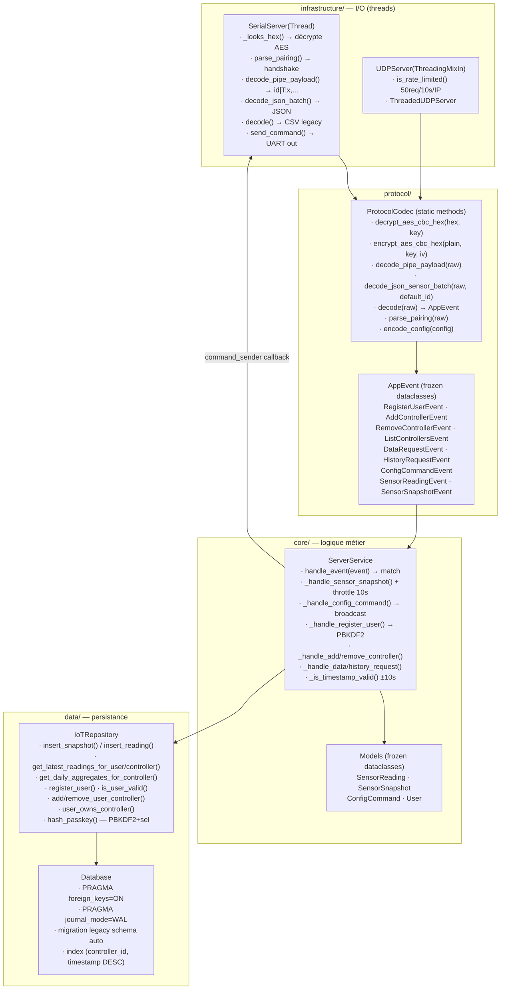

### 8.2 Schéma relationnel SQLite

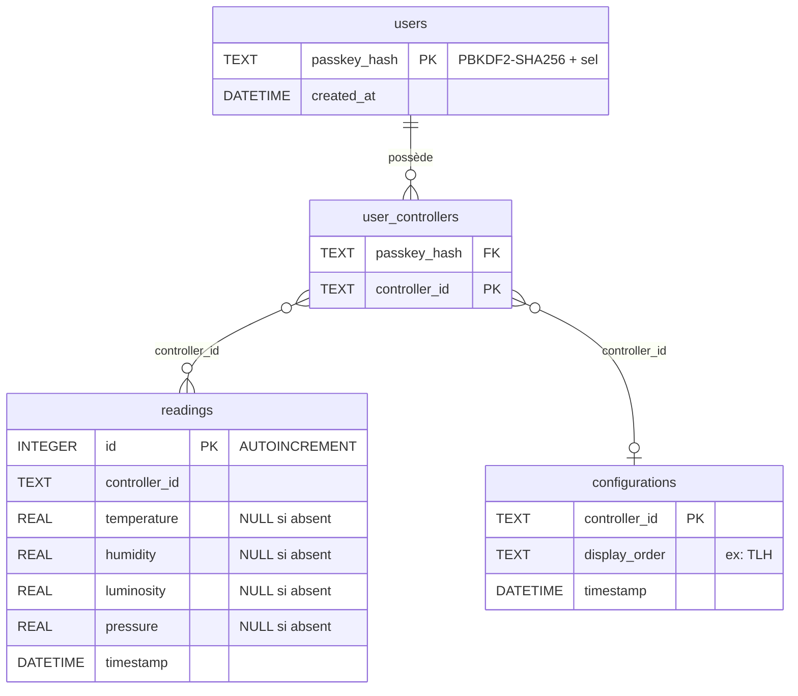

> [!note] Migration automatique
> `database.py` détecte l'ancien schéma (colonne `sensor_id`) au démarrage et pivote les données en snapshots multi-capteurs sans perte. La migration vers `user_controllers` (depuis l'ancien `user_sensors`) est aussi automatique.

### 8.3 Dispatch d'une ligne série

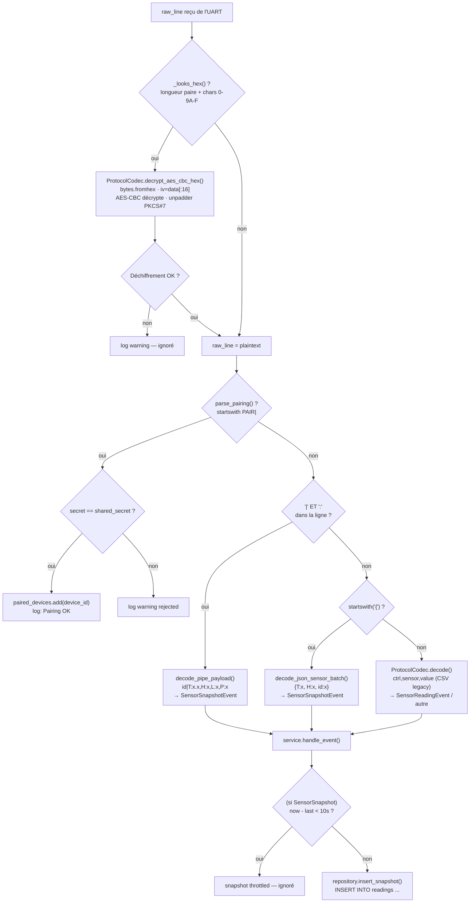

### 8.4 Réponse GET et HISTORY

**GET** — retourne les dernières valeurs "explosées" en lignes `(ctrl, sensor_id, value)` :

```
5E90D3CB,T,22.3
5E90D3CB,H,58.0
5E90D3CB,L,89.0
5E90D3CB,P,1012.0
```

**HISTORY** — agrégats journaliers (14 colonnes) :

```
day,t_avg,t_min,t_max,h_avg,h_min,h_max,l_avg,l_min,l_max,p_avg,p_min,p_max,samples
2026-05-19,22.50,20.10,24.80,57.20,52.00,63.00,,,,1011.30,1008.00,1015.00,12
```

Champs absents (ex: luminosité non reçue) → colonne vide.

### 8.5 Lancement

```bash
cd server
python -m venv .venv && source .venv/bin/activate
pip install -r requirements.txt   # pyserial · cryptography · bcrypt

# Linux
python main.py --serial_port /dev/ttyACM0 --shared-secret groupe67
# Windows
python main.py --serial_port COM3 --shared-secret groupe67
# Options supplémentaires
python main.py --serial-retry 5 --debug --udp_port 10000
```

### 8.6 Tests automatisés — 57 tests

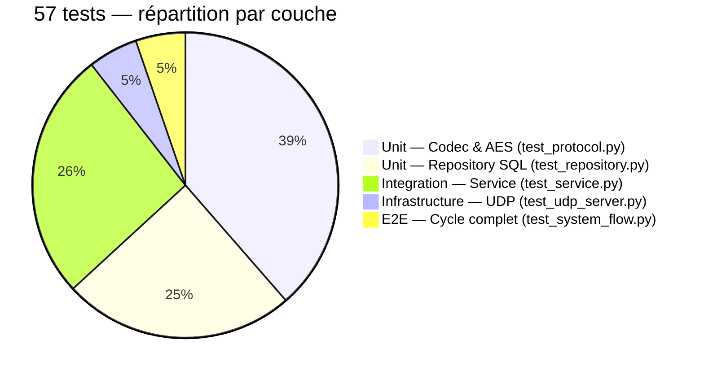

```bash
python -m unittest discover tests   # ~2 secondes, 0 erreur
```

Cas couverts : round-trip AES, parsing pipe/JSON/CSV, throttling 10s, agrégats journaliers, multi-utilisateurs, purge sur REMOVE, rate-limit UDP, validation timestamp, vecteur CBC déterministe.

---

## 9. Application Android (`application/`)

> [!success] Livrable ① — Application Android
> Dossier : `application/` · Documentation : `application/README.md`
> APK : `bureau-bien-etre.apk` · `minSdk` 31 (Android 12+) · `targetSdk` 36

### 9.1 Architecture

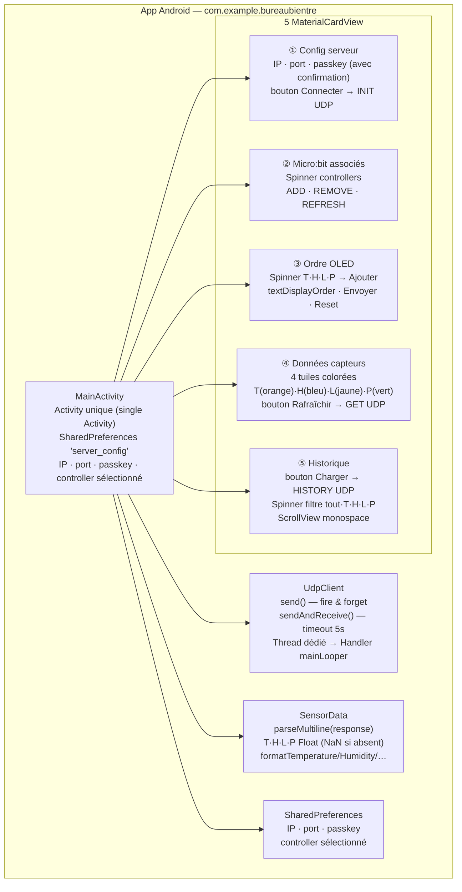

### 9.2 Cycle de vie d'une requête UDP

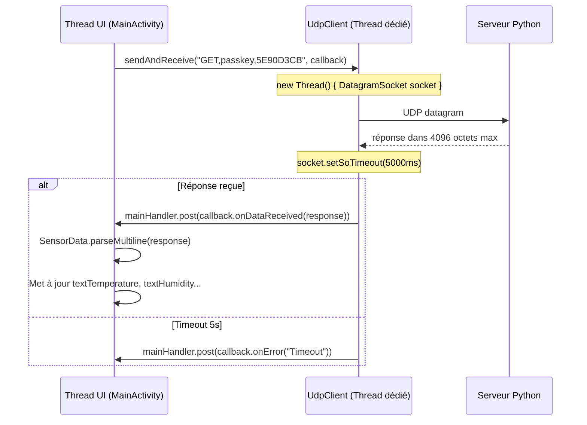

### 9.3 Parsing de la réponse `GET`

`SensorData.parseMultiline()` accepte toutes les variantes de noms de capteurs :

| Codes acceptés | Capteur |
|---|---|
| `T`, `TEMP`, `TEMPERATURE` | Température |
| `H`, `HUM`, `HUMIDITY`, `HUMIDITE` | Humidité |
| `L`, `LUM`, `LUMINOSITY`, `LUMINOSITE` | Luminosité |
| `P`, `PRES`, `PRESSURE`, `PRESSION` | Pression |

Les valeurs absentes restent `Float.NaN` et s'affichent `--` via les méthodes `format*()`.

### 9.4 Construction de l'ordre OLED

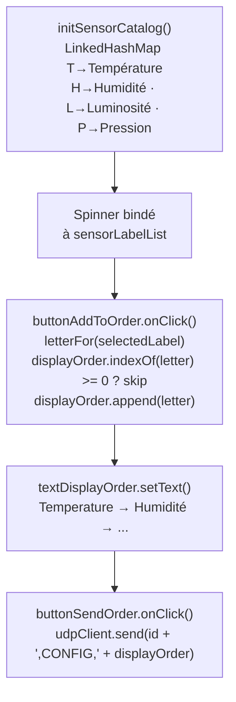

> [!warning] Réseau
> Le smartphone et le PC doivent être sur le **même réseau WiFi**. L'IP du PC (pas `localhost`) doit être saisie dans la section Config. La configuration est persistée en `SharedPreferences` entre les sessions.

### 9.5 Build et installation

```bash
cd application
./gradlew assembleDebug
# APK → app/build/outputs/apk/debug/app-debug.apk

# Installation directe
adb install app/build/outputs/apk/debug/app-debug.apk
# ou depuis l'IDE : Run → installDebug
```

---

## 10. État d'avancement

| Fonctionnalité | État | Détail |
|---|---|---|
| Protocole objet ⇄ passerelle bidirectionnel | ✅ | Radio + UART, event-driven |
| Chiffrement AES-128-CBC + appairage | ✅ | NRF_ECB matériel, IV NRF_RNG |
| Gestion multi-objets | ✅ | `user_controllers` + device_id matériel |
| Capteurs T / H / P | ✅ | BME280, oversampling ×16 |
| Capteur luminosité L | ✅ | Matrice LED comme photodiode |
| Affichage OLED dans l'ordre demandé | ✅ | Tous les cas T/H/L/P gérés |
| Passerelle relais radio ⇄ UART | ✅ | ~50 lignes, `release_fiber()` |
| Serveur UDP + SQLite + getValues() | ✅ | Throttle 10s, WAL mode |
| Format d'échange défini | ✅ | Pipe + JSON + CSV acceptés |
| App Android — config · CRUD · ordre · data · historique | ✅ | 5 sections Material3 |
| Sécurité passkeys PBKDF2 + rate-limit | ✅ | 200 000 itérations |
| 57 tests automatisés | ✅ | Unit + intégration + E2E |
| Interface web type Grafana | ❌ | Optionnel — non réalisé |
| Push automatique serveur → app | ❌ | Optionnel — rafraîchissement à la demande |

> [!success] Toutes les exigences **obligatoires** de l'énoncé sont couvertes.

---

## 11. Choix technologiques

| Brique | Choix | Justification |
|---|---|---|
| Objet / Passerelle | C/C++, micro:bit DAL, yotta | Accès direct NRF_ECB et NRF_RNG — impossible depuis MicroPython |
| Chiffrement | AES-128-CBC matériel (NRF_ECB) | Sécurité réelle, ~6 µs/bloc, pas de lib logicielle |
| IV | NRF_RNG (entropie matérielle) | Garantit l'imprévisibilité, pas de PRNG logiciel |
| Dérivation de clé | Zero-padding 16 octets | Simple à reproduire en compile-time sur le micro:bit |
| Serveur | Python 3 | Référence fournie dans l'énoncé, 3 dépendances seulement |
| Base de données | SQLite WAL | Sans serveur, fichier unique, agrégats SQL natifs |
| Passkeys | PBKDF2-SHA256 200k itér. | Standard industrie, résistance brute-force hors-ligne |
| Architecture serveur | DDD 4 couches | Testabilité par couche, séparation des responsabilités |
| Format radio → UART | Hex ASCII | Transmissible sur UART sans encodage supplémentaire |
| Application | Android natif Java | Contrôle fin des sockets UDP, pas de dépendance tierce |
| Transport app | UDP | Imposé par l'énoncé |

---

## 12. Livrables du rendu

| # | Livrable | Emplacement | Documentation |
|---|---|---|---|
| 1 | **Rapport synthétique** | `rendu.md` (ce document) | — |
| 2 | **Application Android** | `application/` | `application/README.md` |
| 3 | **Code de l'objet connecté** | `micro/` | `micro/README.md` · `micro/NOTES-TP.md` |
| 4 | **Code de la passerelle** | `gateway/microbit-samples/` | `gateway/microbit-samples/README.md` |
| 5 | **Application côté serveur** | `server/` | `server/README.md` |

> [!note] APK de démonstration
> L'APK de debug `bureau-bien-etre.apk` est disponible dans `application/` pour installation directe sans compilation (`adb install`).
