# Rendu — Mini-architecture IoT

**Module** : Développement embarqué et IoT — 2026  
**Groupe** : 13

| Membre | Contribution principale |
|---|---|
| Quentin Bastos | Application Android, protocole serveur, sécurité |
| Théo Demaria | Serveur (architecture, alignement protocole) |
| Adel Hocine Boudjadja | Objet connecté (capteurs, OLED) |
| Arnaud Decourt | Serveur, intégration passerelle |

---

## 1. Objectif du projet

L'objectif est de déployer une **architecture IoT complète** permettant de :

- **Collecter** des données environnementales (température, humidité, pression, luminosité) depuis un micro-contrôleur micro:bit installé dans un bureau.
- **Stocker et exposer** ces données via un serveur Python sur PC.
- **Configurer à distance** l'ordre d'affichage d'un écran OLED depuis un smartphone Android.
- **Gérer plusieurs objets** simultanément dans plusieurs bureaux, pour plusieurs utilisateurs.

---

## 2. Architecture générale

La chaîne IoT repose sur quatre briques communicant en cascade :

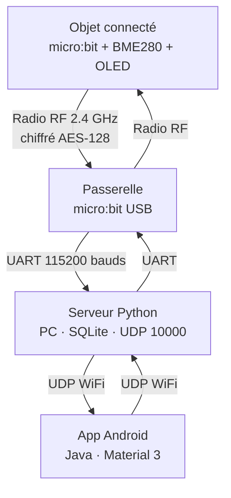

| Brique | Rôle | Technologie |
|---|---|---|
| **Objet** | Mesure, chiffre, émet, affiche OLED | C/C++, micro:bit DAL, yotta |
| **Passerelle** | Relais transparent radio ⇄ UART | C/C++, micro:bit DAL, yotta |
| **Serveur** | Déchiffre, stocke, répond UDP | Python 3, SQLite |
| **App Android** | Configure, contrôle, consulte | Java, Material 3 |

---

## 3. Flux de données

### 3.1 Remontée d'une mesure capteur

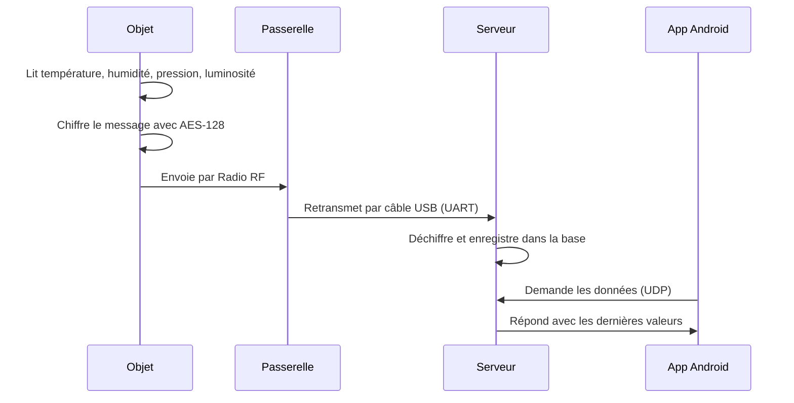

### 3.2 Envoi d'une commande d'affichage

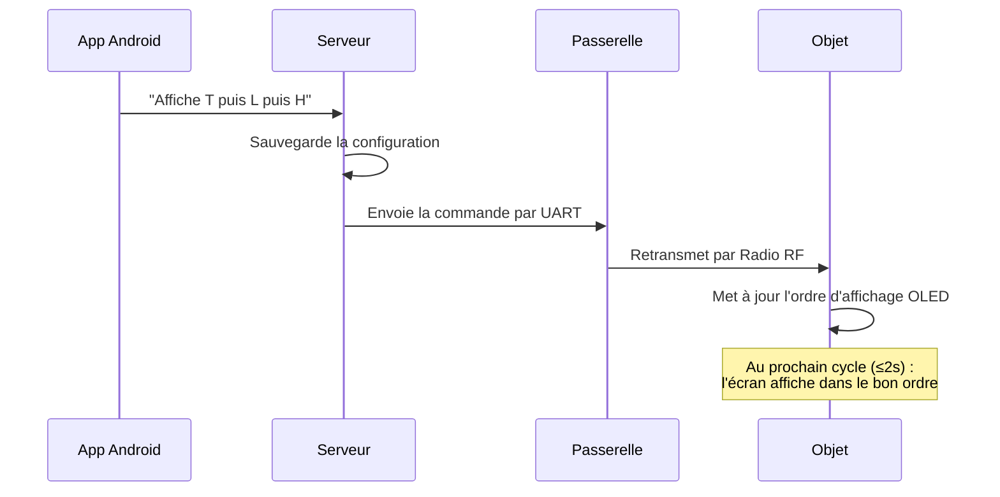

### 3.3 Appairage d'un objet au démarrage

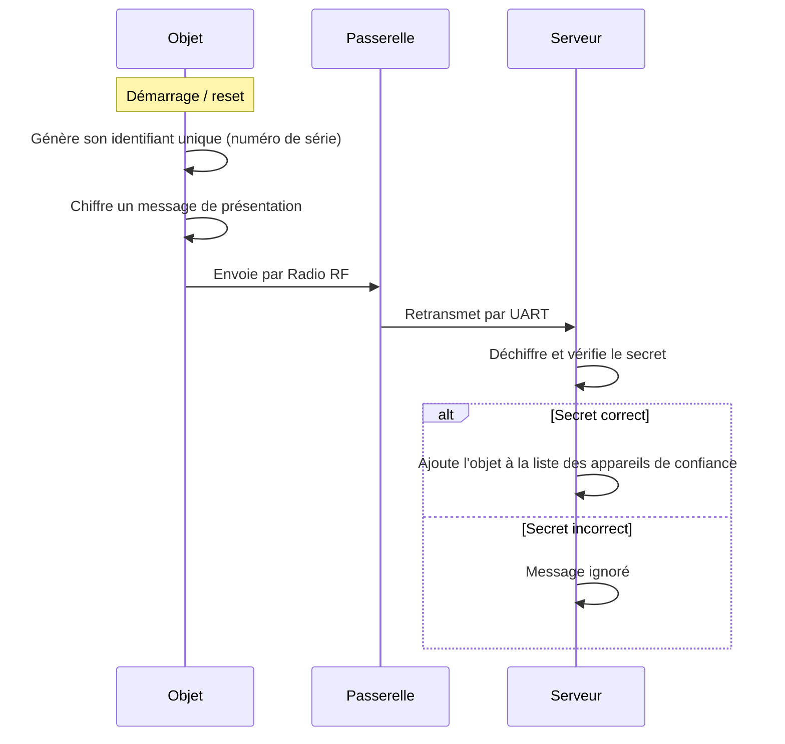

---

## 4. Sécurité

### 4.1 Chiffrement AES-128-CBC

Toutes les trames émises par l'objet sont chiffrées avec AES-128 en mode CBC, en utilisant le module matériel **NRF_ECB** intégré au nRF51. Le vecteur d'initialisation (IV) est généré aléatoirement par le générateur matériel **NRF_RNG** à chaque trame.

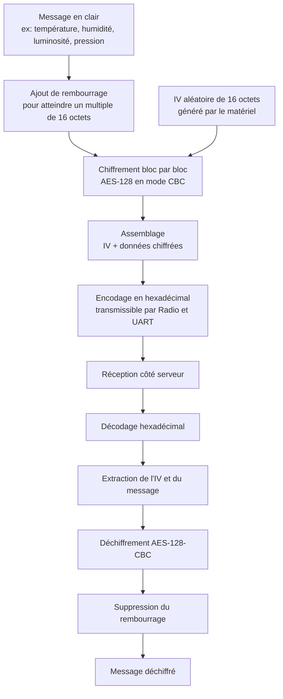

### 4.2 Couches de sécurité complètes

| Couche | Mécanisme | Détail |
|---|---|---|
| **Radio → UART** | AES-128-CBC | IV unique par trame (matériel), encodage hex |
| **Appairage** | Message chiffré avec secret partagé | Seuls les objets connaissant le secret sont acceptés |
| **Passkeys** | PBKDF2-SHA256 | 200 000 itérations avant stockage |
| **Anti-rejeu** | Horodatage Unix ±10 s | Empêche la réutilisation d'anciens messages |
| **Rate-limit UDP** | 50 requêtes / 10 s / adresse IP | Protection contre le brute-force |
| **Ownership** | Table `user_controllers` SQLite | Un objet n'appartient qu'à un seul utilisateur |

---

## 5. Objet connecté (`micro/`)

### 5.1 Matériel embarqué

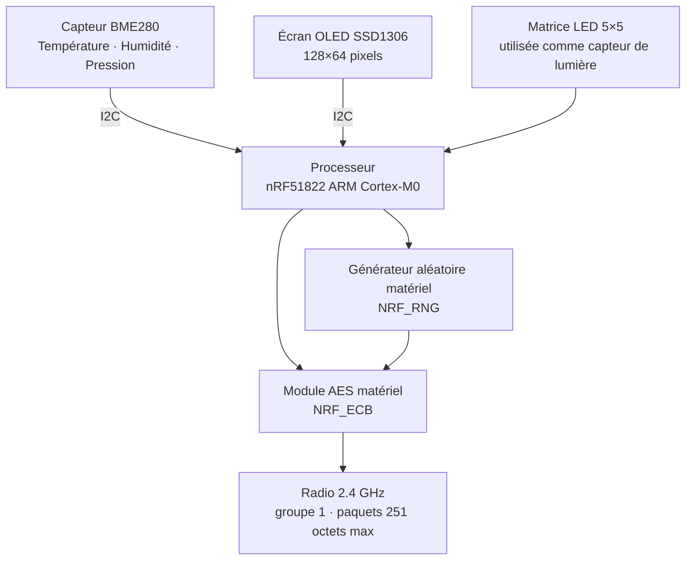

### 5.2 Lecture et compensation BME280

Le BME280 ne fournit pas directement des degrés ou des pourcentages : il retourne des valeurs brutes (ADC) qui doivent être converties grâce à 18 coefficients de calibration (3 pour la température, 9 pour la pression, 6 pour l'humidité) lus au démarrage du capteur. Cette compensation est définie par Bosch dans la datasheet du capteur.

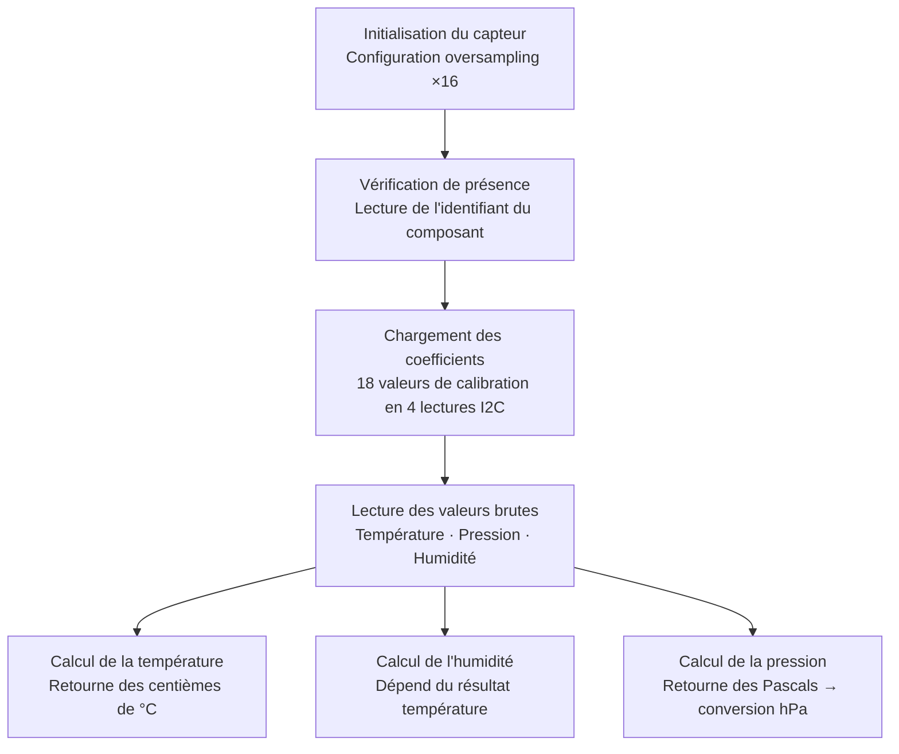

Exemple : valeur interne `2230` → affichage `22.3 °C`, valeur interne `5800` → affichage `58 %`.

### 5.3 Affichage sur l'écran OLED SSD1306

L'écran est géré via un **buffer image de 1024 octets** maintenu en mémoire. Chaque mise à jour de l'écran envoie ce buffer complet en un seul transfert I2C, ce qui garantit un affichage sans scintillement.

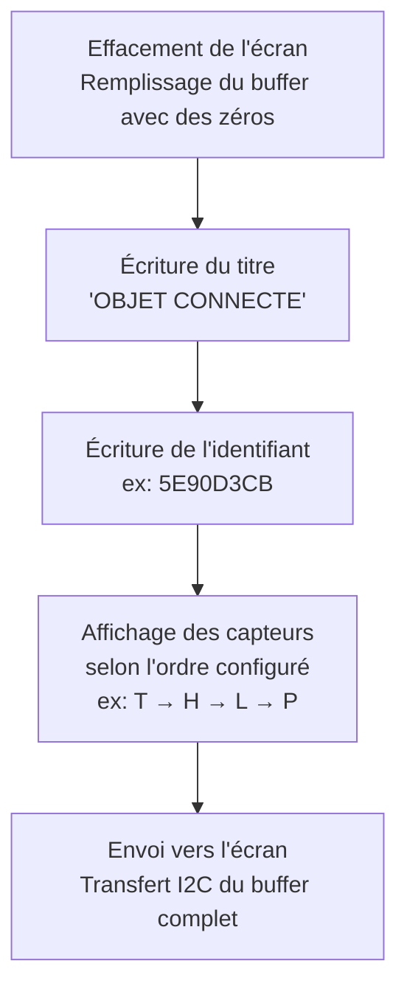

Chaque caractère occupe une tuile de 8×8 pixels issue d'une police bitmap embarquée. L'ordre des lignes (`T`, `H`, `L`, `P`) est mis à jour dynamiquement via la commande `CONFIG` reçue depuis l'application.

### 5.4 Boucle principale — cycle de 2 secondes

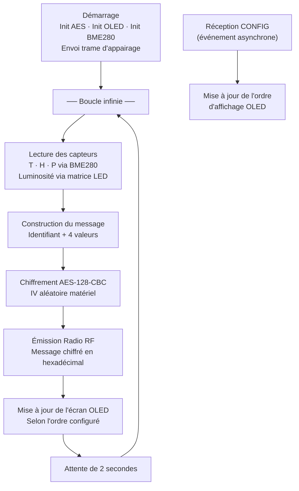

La réception d'une commande `CONFIG` est traitée de façon asynchrone grâce au **scheduler fiber** du DAL micro:bit : l'événement s'intercale entre les étapes de la boucle principale sans bloquer les mesures.

### 5.5 Structure des fichiers

```
micro/source/
├── main.cpp       Boucle principale · chiffrement · réception CONFIG
├── bme280.cpp/.h  Pilote capteur T/H/P avec compensation Bosch
├── ssd1306.cpp/.h Pilote écran OLED 128×64
├── nrf_ecb.c/.h   Pilote module AES matériel
└── font.h         Police bitmap 8×8 pixels
```

### 5.6 Environnement de build

```bash
# Image Docker officielle du module
docker pull schoumi/yotta:latest
docker run -it -v "$PWD:/workspaces/microbit-samples" schoumi/yotta:latest

# Dans le conteneur
source /sync/Module_Dev_app_mobile/yotta/bin/activate
yt build

# Flash (Linux)
make install
# Flash (macOS)
cp build/bbc-microbit-classic-gcc/source/microbit-samples-combined.hex /Volumes/MICROBIT/
```

---

## 6. Passerelle (`gateway/microbit-samples/`)

### 6.1 Principe — relais transparent

La passerelle ne contient **aucune logique métier**. Son seul rôle est de faire suivre les messages dans les deux sens, sans les modifier. Elle est construite avec les mêmes outils que l'objet (yotta, micro:bit DAL) et repose sur deux gestionnaires d'événements enregistrés au démarrage. Le programme principal se termine immédiatement par `release_fiber()` qui passe la main au scheduler d'événements du DAL, lequel reste actif indéfiniment.

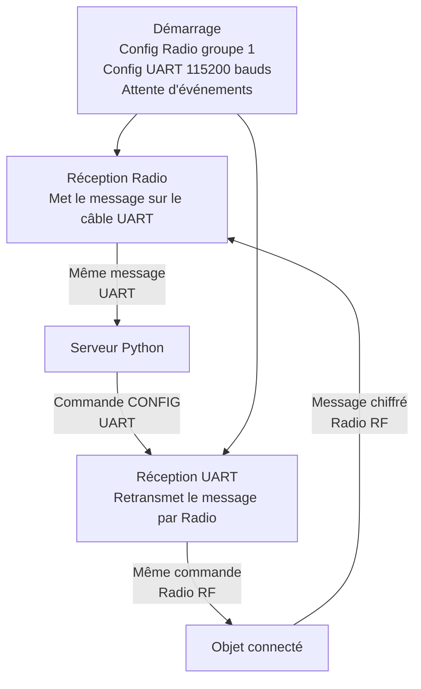

### 6.2 Configuration

| Paramètre | Valeur | Raison |
|---|---|---|
| Bluetooth | Désactivé | Libère la radio pour le mode datagramme |
| Taille max paquet radio | 251 octets | Accueille un message chiffré en hexadécimal |
| Groupe radio | 1 | Identique à l'objet connecté |
| Débit UART | 115 200 bauds | Correspond à la config du serveur |
| Délimiteur | `\n` | Sépare les trames côté Python |

### 6.3 Build et flash

```bash
source /sync/Module_Dev_app_mobile/yotta/bin/activate
make build      # yt build
make install    # copie le .hex vers /media/$USER/MICROBIT/
```

---

## 7. Serveur (`server/`)

Dépendances Python : `pyserial` · `cryptography` · `bcrypt` (3 bibliothèques seulement).

### 7.1 Architecture en couches

Le serveur est organisé en 4 couches indépendantes selon le principe de séparation des responsabilités (Domain-Driven Design). Chaque couche ne connaît que la couche en dessous d'elle.

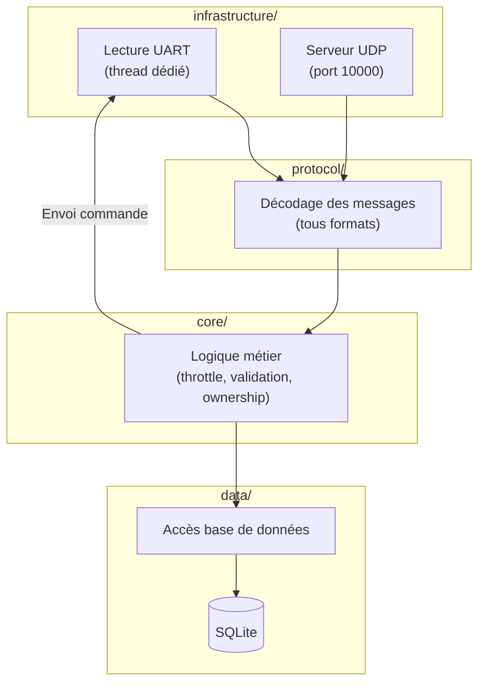

**Responsabilités de chaque couche :**

- `infrastructure/` — Lecture UART avec déchiffrement AES et retransmission vers l'objet. Serveur UDP avec rate-limit (50 req/10s/IP).
- `protocol/` — Détecte et décode les 4 formats acceptés (hex chiffré, pipe, JSON, CSV) et encode les réponses.
- `core/` — Logique métier : throttle 10s (une insertion par contrôleur toutes les 10 secondes), validation horodatage ±10s, vérification d'ownership.
- `data/` — Toutes les requêtes SQL, migration automatique de l'ancien schéma, connection SQLite en mode WAL.

### 7.2 Schéma relationnel SQLite

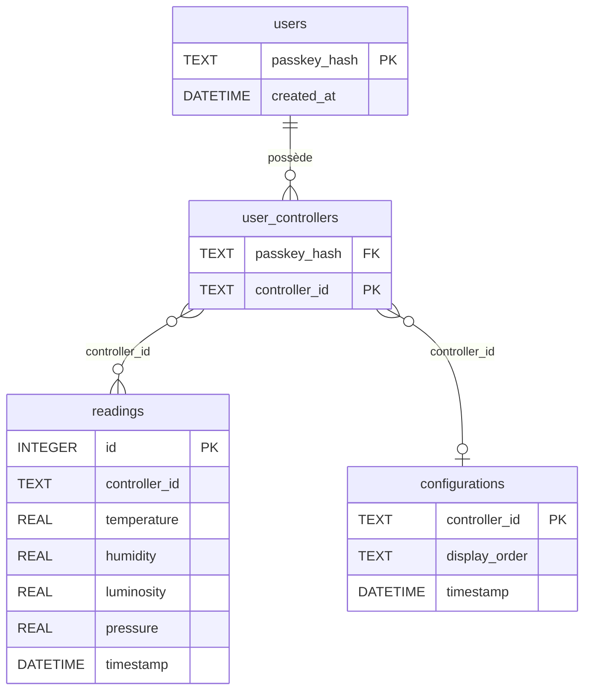

Un index sur `(controller_id, timestamp DESC)` dans `readings` accélère les requêtes de consultation et d'historique.

### 7.3 Traitement d'un message serie

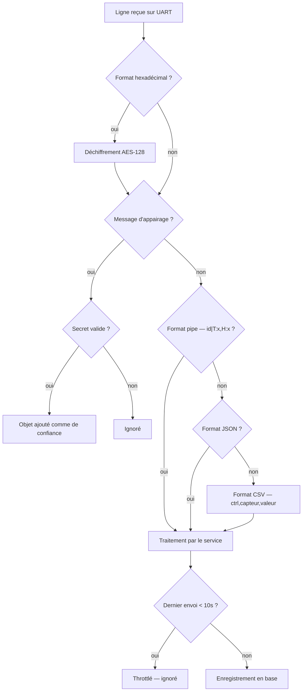

### 7.4 Format des réponses

**GET** — une ligne par capteur disponible :
```
5E90D3CB,T,22.3
5E90D3CB,H,58.0
5E90D3CB,L,89.0
5E90D3CB,P,1012.0
```

**HISTORY** — 14 colonnes par jour (moyenne/min/max pour T, H, L, P + nombre de mesures) :
```
2026-05-19,22.50,20.10,24.80,57.20,52.00,63.00,,,,1011.30,1008.00,1015.00,12
```

### 7.5 Lancement

```bash
cd server
python -m venv .venv && source .venv/bin/activate
pip install -r requirements.txt

# Linux
python main.py --serial_port /dev/ttyACM0 --shared-secret groupe67
# Windows
python main.py --serial_port COM3 --shared-secret groupe67
# Le secret doit rester identique a SHARED_SECRET dans micro/source/main.cpp.
# Options supplémentaires : --serial-retry 5 --debug --udp_port 10000
```

### 7.6 Tests automatisés — 57 tests

Le serveur dispose d'une suite de tests complète qui valide chaque couche indépendamment. Ces tests permettent de détecter rapidement les régressions et de garantir la fiabilité du comportement global.

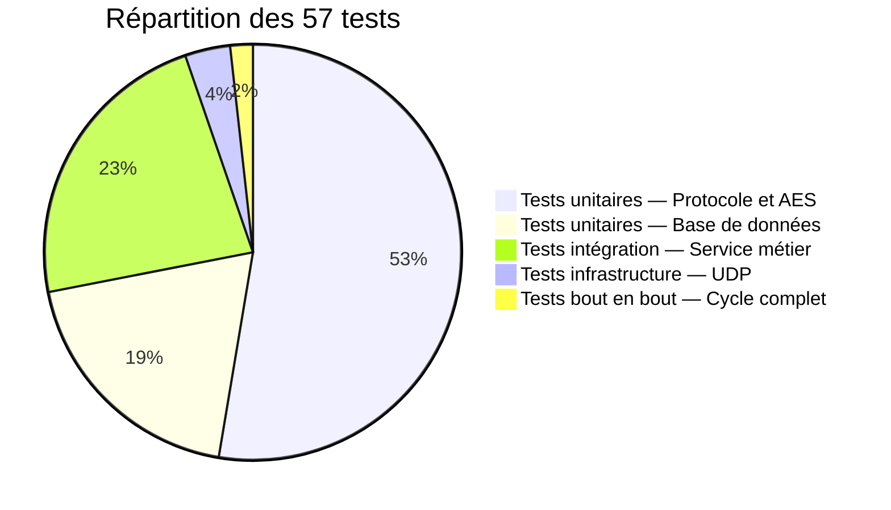

Les cas couverts incluent notamment : le chiffrement/déchiffrement AES avec vecteur fixe, le parsing de tous les formats, le throttle 10s, les agrégats journaliers, les scénarios multi-utilisateurs, la purge des données lors d'un `REMOVE`, le rate-limit UDP et la validation des horodatages.

```bash
python -m unittest discover tests   # ~2 secondes, 0 erreur
```

---

## 8. Application Android (`application/`)

`minSdk` 31 (Android 12+) · `targetSdk` 36 · Java · Material 3

### 8.1 Structure du code

```
app/src/main/java/com/example/bureaubientre/
├── MainActivity.java   Activité unique — UI, état, appels réseau
├── UdpClient.java      Envoi simple ou envoi + attente réponse (timeout 5s)
└── SensorData.java     Parsing des données capteurs · NaN si absent
```

### 8.2 Interface utilisateur — 5 sections Material3

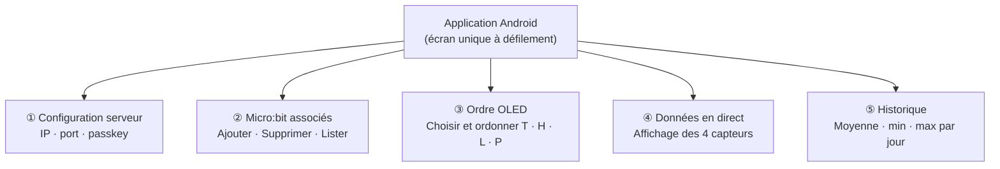

### 8.3 Protocole UDP côté Android

| Commande envoyée | Réponse serveur |
|---|---|
| `INIT,<passkey>` | `OK` |
| `LIST,<passkey>` | `ctrl1\nctrl2\n…` |
| `ADD,<passkey>,<id>` | `OK` / `UNAUTHORIZED` |
| `REMOVE,<passkey>,<id>` | `OK` / `ERROR` |
| `GET,<passkey>,<id>` | `ctrl,T,22.3\nctrl,H,58\n…` |
| `HISTORY,<passkey>,<id>,7` | CSV agrégé (14 colonnes/jour) |
| `<id>,CONFIG,TLH` | *(transmis vers l'objet via le serveur)* |

Chaque appel réseau est exécuté sur un thread dédié. Les résultats reviennent sur le thread principal via un Handler, conformément aux bonnes pratiques Android.

### 8.4 Construction de l'ordre OLED

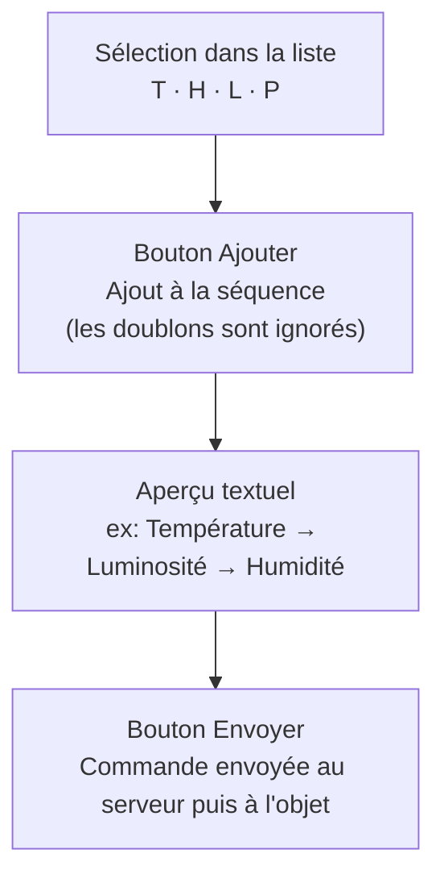

### 8.5 Build et installation

```bash
cd application
./gradlew assembleDebug
# APK → app/build/outputs/apk/debug/app-debug.apk

adb install app/build/outputs/apk/debug/app-debug.apk
```

Le smartphone et le PC doivent être sur le **même réseau WiFi**. Saisir l'**adresse IP du PC** (pas `localhost`) dans l'écran de configuration. La configuration est persistée automatiquement entre les sessions.

---

## 9. État d'avancement

| Fonctionnalité | État | Détail |
|---|---|---|
| Protocole objet ⇄ passerelle bidirectionnel | ✅ | Radio + UART, event-driven |
| Chiffrement AES-128-CBC + appairage | ✅ | NRF_ECB matériel, IV NRF_RNG |
| Gestion multi-objets | ✅ | Ownership par utilisateur |
| Capteurs T / H / P (BME280) | ✅ | Oversampling ×16, compensation Bosch |
| Capteur luminosité L | ✅ | Matrice LED utilisée comme photodiode |
| Affichage OLED dans l'ordre demandé | ✅ | Tous les cas T/H/L/P gérés |
| Passerelle relais radio ⇄ UART | ✅ | ~50 lignes, entièrement événementiel |
| Serveur UDP + SQLite | ✅ | Throttle 10s, mode WAL |
| Formats d'échange (pipe / JSON / CSV) | ✅ | Tous acceptés |
| App Android (config, ordre, données, historique) | ✅ | 5 sections Material3 |
| Sécurité passkeys PBKDF2 + rate-limit UDP | ✅ | 200 000 itérations |
| 57 tests automatisés | ✅ | Unitaires + intégration + bout en bout |
| Interface web type Grafana | ❌ | Optionnel — non réalisé |
| Push automatique serveur → app | ❌ | Optionnel — l'app rafraîchit à la demande |

Toutes les exigences **obligatoires** de l'énoncé sont couvertes.

---

## 10. Choix technologiques

| Brique | Choix | Justification |
|---|---|---|
| Objet / Passerelle | C/C++, micro:bit DAL, yotta | Accès direct aux modules AES et RNG matériels — impossible depuis MicroPython |
| Chiffrement | AES-128-CBC matériel (NRF_ECB) | Sécurité réelle, quelques µs par bloc, sans bibliothèque logicielle |
| IV | NRF_RNG (entropie matérielle) | Imprévisibilité garantie par le matériel |
| Serveur | Python 3 | Référence fournie, 3 dépendances seulement |
| Base de données | SQLite WAL | Sans serveur, fichier unique, agrégats SQL natifs |
| Passkeys | PBKDF2-SHA256 200k itér. | Standard industrie, résistance brute-force |
| Architecture serveur | DDD 4 couches | Testabilité par couche, séparation des responsabilités |
| Format radio → UART | Hexadécimal ASCII | Transmissible sur UART sans encodage supplémentaire |
| Application | Android natif Java | Contrôle fin des sockets UDP, zéro dépendance tierce |
| Transport app | UDP | Imposé par l'énoncé |
